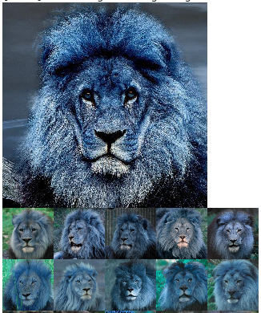
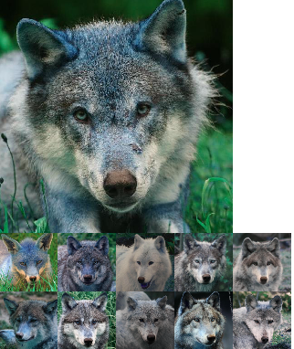
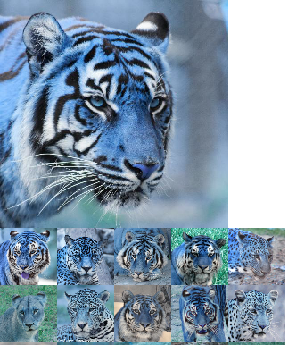
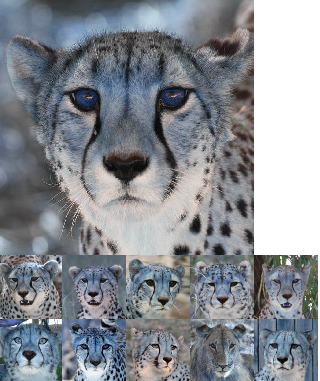
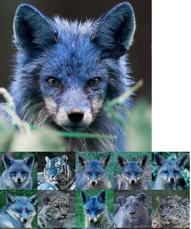

# Image Retrieval using Autoencoders

[![Build Status][travis-image]][travis-url]

This repository shares a deep-learning based Image Retrieval system using Autoencoders which involves taking as input a query image in an unsupervised setting and finding the closest `N` number of similar images, where `N` can also be given as input.

## Autoencoders:

Autoencoders are a variant of neural networks which are often used for unsupervised tasks whose goal is to copy its input to its output. It has a hidden layer z that describes a code used to represent the input. Auto-encoders are comprised of two parts; the encoder, z = f(x), this part of the network is responsible for encoding the input into a latent-space representation. The decoder, aims to reconstruct the input from the latent-space representation, r = g(z).

<p align = "center">

</p>

## Implementation

There are mainly three stages involved:

- We implement a convolutional autoencoder that we train on our image dataset.
- Once the autoencoder is trained, we compute feature vectors for each image in our dataset. Computing the feature vector for a given image requires only a forward-pass of the image through the network — the output of the encoder (i.e., the latent-space representation) will serve as our feature vector.
- After all images are encoded, we can then compare vectors by computing the distance between them. Images with a smaller distance will be more similar than images with a larger distance.

### Data Description

The data was adopted from [here](https://drive.google.com/file/d/1VT-8w1rTT2GCE5IE5zFJPMzv7bqca-Ri/view). It consists of `4738` images of animals of `512x512` dimension.
For training the autoencoder, 70% of the data was used for training and about >25% for validation set.

## Requirements and Installation:

Tested for Ubuntu Linux 18.04:

```
pip install -r requirements.txt
```

## Usage:

- Finding `N` similar images:

```
main.py [-h] -c CLASSPATH [-N SIMILAR]

```
where CLASSPATH is the dataset directory and SIMILAR is the no. of similar images to retrieve from the query image.
### NOTE: The Classpath directory structure looks as shown below with test folder containing the query image(s).

```
data
├── tain
├── val
└── test
```
## Examples:

<table>
  <tr>
    <td>Successfull attempts</td>
    <td>Successfull attempts</td>
  </tr>
  <tr>
    <td></td>
    <td></td>
  </tr>
 </table>

<table>
  <tr>
    <td>Successfull attempts</td>
    <td>Successfull attempts</td>
  </tr>
  <tr>
    <td></td>
    <td></td>
  </tr>
 </table>
 
 <table>
  <tr>
    <td>Unsuccessfull attempts</td>
  </tr>
  <tr>
    <td></td>
  </tr>
 </table>

The unsuccessfull attempt can be attributed to the fact that more training time is required for properly tuning the hyperparameters and in the limited time frame this was model was developed.

## Meta

Abhishek Singh – [@abhish3k_sunny](https://twitter.com/abhish3k_sunny) – abhishek.nitdgp.98@gmail.com


[ZER-0-NE](https://github.com/ZER-0-NE)


<!-- Markdown link & img dfn's -->

[travis-image]: https://img.shields.io/travis/dbader/node-datadog-metrics/master.svg?style=flat-square
[travis-url]: https://travis-ci.org/dbader/node-datadog-metrics